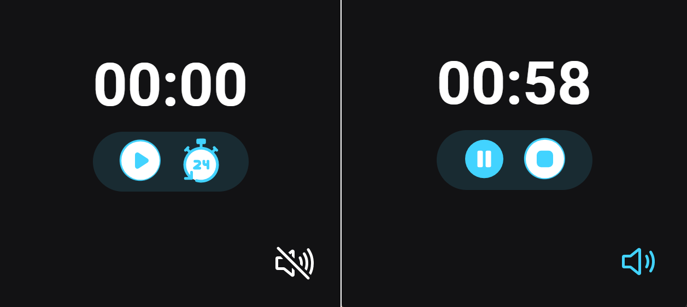
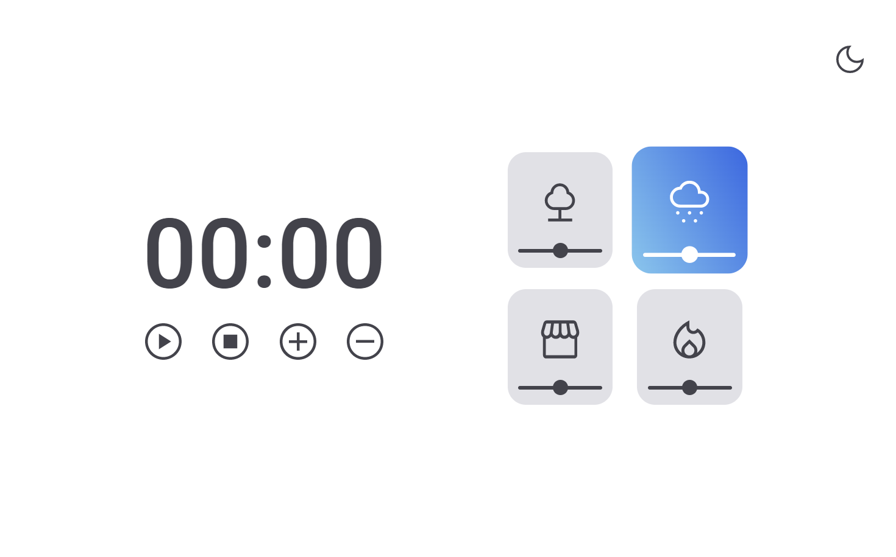
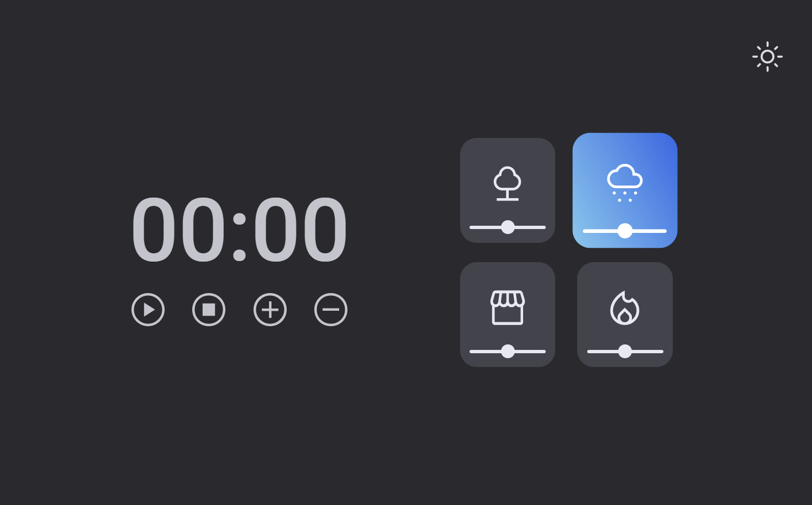

# Projetos-FocusTimer

> FocusTimer 1.0.

* Estudo e aplicação de HTML, CSS e JavaScript, no desenvolvimento do projeto FocusTimer 1.0.

## Tecnologias
- HTML
- CSS
- JavaScript
- Git (e/no Github)
 

[Clique aqui para acessar](https://karinewagner.github.io/Projetos-FocusTimer/FocusTimer-1.0/) ☺️👍

1º Zerado / 2º Em andamento (ative o som)
 
 
 

> FocusTimer 2.0.

## Funcionalidades
- Ao clicar no horário 00:00, você poderá definir uma quantidade específica de tempo em minutos.
- Botão de Play/Stop: Inicia/Pausa o tempo definido no cronometro
- Botão de Mais(+)/Menos(-): Incrementa/Decrementa o timer em 5 minutos
- Botões de som ambiente: Ativa/Desativa entre 04 opções (floresta, chuva, cafeteria e/ou fogueira)
- Controle de volume do som ambiente
- Botão troca de tema: alterna entre Light e Dark

## Tecnologias
- HTML
- CSS
- JavaScript
- Git (e/no Github)
 

1º Zerado e tema claro / 2º Zerado e tema escuro

[Clique aqui para acessar](https://karinewagner.github.io/Projetos-FocusTimer/FocusTimer-2.0/) ☺️👍

 
 

OBS: Projeto com o objetivo da aplicação do conhecimento em HTML, CSS e JavaScript.
